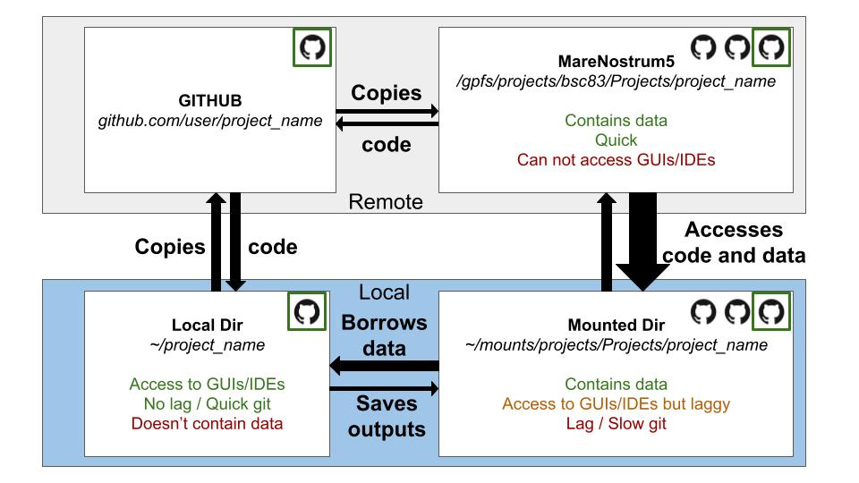

# Working within the project template

## GIT USAGE RULES (IMPORTANT)

* Always create a branch before starting to work by running `git pull origin <branch name>`
* Work on your own branch, but try to merge into main as frequently as you can to avoid diverging too much from main (which will be difficult to solve)
* Maintain the [`.gitignore`](.gitignore) complete! Ie, should be able to run `git add -A` without accidentally pushing large / unnecessary files
* Remember to update config file with important files and directories. You only have to update [resources/config.yml](resources/config.yml). The mn5 version of it is generated automatically
* To commit your work and push, run:
```bash
git add -A; git commit -m "update"; git push origin <branch name>
```
* GitHub actions will automatically try to keep your READMEs linked and up-to-date

## Repository content

* [metadata](metadata): Instructions / code for picking relevant datasets and getting / formatting their metadata. Final metadata tables.
* [resources](resources): R and Python files with importable functions. YML file with project settings and global variables (color schemes, paths for different systems, etc.)
* [processing](processing): Processing pipelines and code to perform cluster computation.
* [analysis](analysis): Analysis, data wrangling, plotting, and statistical testing.
* [tests](tests): Code to test utilities for development purpose.

## Templates

We provide several templates with the **mandatory** headers for R, python and bash and to help familiarize you with how to interface with the environment:

* [R](analysis/template.R)
* [Python](analyis/template_python.ipynb)
* [Snakemake workflow](processing/template_snakemake/)

## Structuring your directories

Though we recommend dividing your code roughly between [analysis](analysis/) and [processing](processing/), you can add whatever directories you want and you will still have access to the environment and utilities that make the environment work.

## Adding / updating users information

If you add a new user to the project, or want to add another system you're working on,
simply edit [resources/resources.yml](resources/resources.yml) from YOUR user directory and run `python resources/add_new_users.py` **from the user's directory** (ie `<project_name>/<user>/`). NOT from the template_user directory

<!-- ## Other files details
* [`requirements.txt`](requirements.txt): Python libraries needed to run the code in this repo. -->


## The yml files

This project template relies on two `*.yml` files to work: [`config.yml`](resources/config.yml) and [`resources.yml`](resources/resources.yml).

#### [`resources.yml`](resources/resources.yml)

Holds global settings related to path resolution. You will only need to edit this as part of the [project setup](../README.md#installation-instructions) or if you wish to [add a new user](#adding--updating-users-information).

Instructions on filling out [`resources.yml`](resources/resources.yml) `setup_settings`:

* **`project_name`**: What to name the parent directory of the project
* **`users`**: The listed users will be used to name the subfolders under `<project_name>`, ie `<project_name>/<user1>`, `<project_name>/<user2>`. These are NOT the same as usernames!
* **Usernames**: Determine on each system (ie MN5, local) using the bash command `echo $USER`
* For mn5 systems, all default paths will be automatically added (scratch, data, and projects)
* For local systems, we recommend adding the paths you mount these paths to (scratch, data, and projects)
* For all systems, project directory-relative paths (`<project_name>/{data|ref|figures|metadata}`) will be auto-generated
* If you want to enable quick access to another path, you can add as many entries as you want with the names that end in `*_dir`. Just ensure that each user / system combination has it defined as well!

#### [`config.yml`](resources/config.yml)

The main purpose of this file is to store the location of files you wish to share as part of the project, as well as other project settings you want to standardize, such as color schemes or parameter choices.

In this file, you have access to all path prefixes defined in [`resources.yml`](resources/resources.yml), which will enable you to:

1. Refer to files to share with shorter paths and
2. Refer to files across systems (ie MN5 and locally) without having to keep the two sets of paths

The syntax for using the paths from [`resources.yml`](resources/resources.yml) in [`config.yml`](resources/config.yml) is `./{<dir_name>}`.

Example:

```yml
sam_file: ./{data_dir}/fake_dir/example.sam
```

#### [`config_mn5.yml`](resources/config_mn5.yml)

This yml file is a parallel version of [`config.yml`](resources/config.yml) with the full MN5 paths to files filled out. It is automatically created by [GitHub actions](#github-actions). This file might be useful for sharing files with people that are not necessarily fully-integrated with or working on the project.

## Programmatically accessing paths or files from [`config.yml`](resources/config.yml) or [`resources.yml`](resources/resources.yml)

The main benefit to maintaining your files listed in [`config.yml`](resources/config.yml) is your ability to refer to them across systems using more human-readable paths.

In Python, you can access files and absolute paths the following way:
```Python
from pyprojroot.here import here
import sys

sys.path = [str(here())]+sys.path

from resources.utils import *

config = load_config()
paths = load_paths()

paths['data_dir']
config['data']['sam']
```

And in R, like this:
```R
library(here)

source(here("resources", "utils.r"))

config <- load_config()
paths <- load_paths()

paths$data_dir
config$data$sam
```

## Adding new functions

If you wish to add new functions that you can access across the scope of the project, you can either:

* Add functions to `utils.py` / `.r` or
* Create your own functions in separate `*.py` or `*.r` files

Importing your functions is then as easy as copying the headers in the [template files](#templates), and adjusting the relevant imports / source calls to include the files with your functions:

```R
library(here)
source(here("resources", "utils.r"))
source(here("resources", "my_custom_functions.r"))
```

```python
from pyprojroot.here import here
import sys

sys.path = [str(here())]+sys.path

from resources.my_custom_functions import *
```

## GitHub actions

By default, when you push, GitHub actions will automatically update a few files:

* [`resources/config_mn5.yml`](resources/config_mn5.yml): Generated automatically; contains full MN5 paths to each data file. Useful when you need to share like a few files to someone without fully integrating them into the project.
* Add bullet points in READMEs for each subfolder created under [analysis](analysis) and [processing](processing) with descriptions that can be filled in later; helpful to document your project as you go.
* Add links to all GitHub-tracked files in READMEs to make it easier to navigate your repo on the web.

GitHub actions are stored in [.github/workflows/](.github/workflows).

## Do not touch!

* [resources](resources/): Don't change the name of this directory
* [`utils.py`](resources/utils.py) / [`utils.r`](resources/utils.r): Don't modify existing functions; though you can add new ones, see [this section](#adding-new-functions)
* [.here](.here): Makes all `source()` (R) and `import` (Python) calls work. Do not move, rename, or remove

## Managing mounting

* **Set up local mounting structure**:
Mountings are a way to access remote filesystems (eg. HPC cluster) as they were integrated into our local filesystem (as if they were inside our computer).
We recommend having two directoriess, one for `/gpfs/projects/bsc83` (aka projects) and another for `/gpfs/scratch/bsc83` (aka scratch).
You can do it as follows (recommendation: add it in the `~/.bashrc` as a function):
```bash
sudo vim ~/.bashrc # you can also use nano or manually edit it with a GUI
```
Copy the following functions within `~/.bashrc` (remember to manually replace `<bscuser>`, `<projects_target_directory>` (where projects will be mounted to) and `<scratch_target_directory>` (where scratch will be mounted to):
```bash
mountprojects(){
echo "-Trying to mount MareNostrum5: Projects"
sshfs -o workaround=rename <bscuser>@transfer1.bsc.es:/gpfs/projects/bsc83/ <projects_target_directory> # replace with your bsc user and your target directory (eg. /home/pclavell/mounts/projects)
echo "MareNostrum5 Projects mounted"
}

mountscratch(){
echo "Trying to mount MareNostrum5: Scratch"
sshfs -o workaround=rename <bscuser>@transfer1.bsc.es:/gpfs/scratch/bsc83/ <scratch_target_directory> # replace with your bsc user and your target directory (eg. /home/pclavell/mounts/scratch)
echo "MareNostrum5 Scratch mounted"
}

mountall(){
mountprojects
mountscratch
}
```

Create `<projects_target_directory>` and `<scratch_target_directory>`:

```bash
cd ~
mkdir <projects_target_directory>
mkdir <scratch_target_directory>
```

## Advice for managing git, mounting, and cluster

This organization framework is designed to automatically detect if you are working in local/mounting or in the cluster. It is very useful to work on the mounting because we can use IDEs and GUIs like Rstudio and VScode. However, in many cases we have mounting lag causing code loss and annoying lagginess. With this framework this is partially solved:
- mount as usual (it will be used as source of the data and for outputs)
- instead of working in the mounted dirs, clone your project repository (created during installation) to your local filesystem.

If you do it correctly, you will be able to access your code from this local directory and also from the mounted directory. The local directory is where you will work on your code, the mounted directory will be the source of the data. The advantage of this framework is that all paths will work the same. Just remember to keep using git and pull/push.

